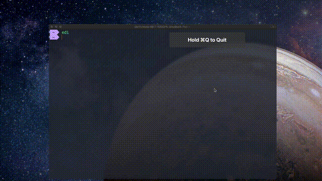

# Edimension auto login bot
A script that can save a lot of time by automatically logging users into the school resource page https://Edimension.sutd.edu.sg

## Installation
Two options:
- ### Auto installation script
#### Mac OS and GNU\Linux supported

```
bash -c "$(curl -s https://raw.githubusercontent.com/darthnoward/edi_auto_login_bot/master/install.sh)"
```
curl, pip and git required, follow the instruction to key in information.

- ### Manuel Installation
Satisfy the Prerequisites below.

## Prerequisite
- Chrome or Chromium with a minimal version of 79
- chromedriver installed in /usr/local/bin (Download from https://chromedriver.chromium.org)
- Python and Selenium library installed 
- create a file named myinfo.py in the same directory as main.py and put in your username and password, like
```
username = "SUTDSTU\\1000000"
password = "woah_haolan_is_so_cute_lol"
# Change the values to your own
```
- change the environment path in the first line to you own, you can look it up by 
```
$ which python3
```
- make the script executable, by 
```
$ chmod +x main.py 
```

### Nice to have:
create an alias in your favourite shell config, in my case, in ~/.zshrc:
```
alias edi=~/edi_auto_login_bot/main.py
```
so that you can run it more conveniently. 

Note: create a symbolic link to /usr/local/bin isn't effective as it takes value from myinfo.py 

## Usage 
In your terminal:
```
main.py                         login to the main page

main.py math
main.py maths
main.py ma                      login, go to content section of math modules 

edi                             if you are using auto installation script    
``` 
**Note: The raw script only applys to the four modules of class 2022 Term 3 in SUTD**  

## DEMO 



*Sweet*

### Licence
Licensed under the [MIT license](./LICENSE)
